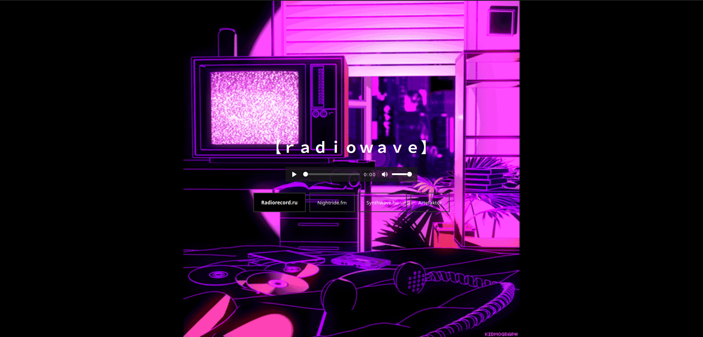
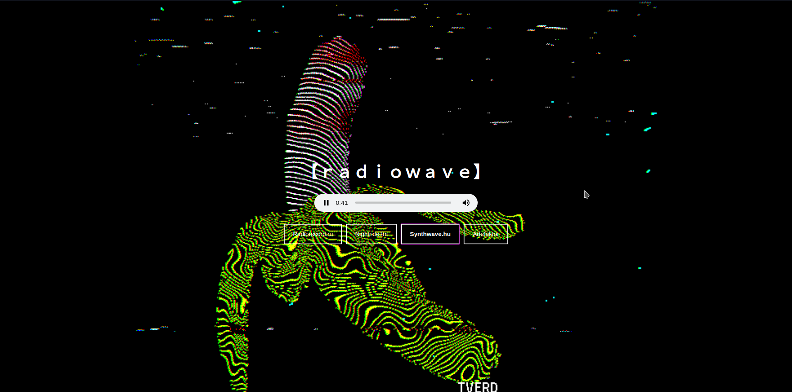
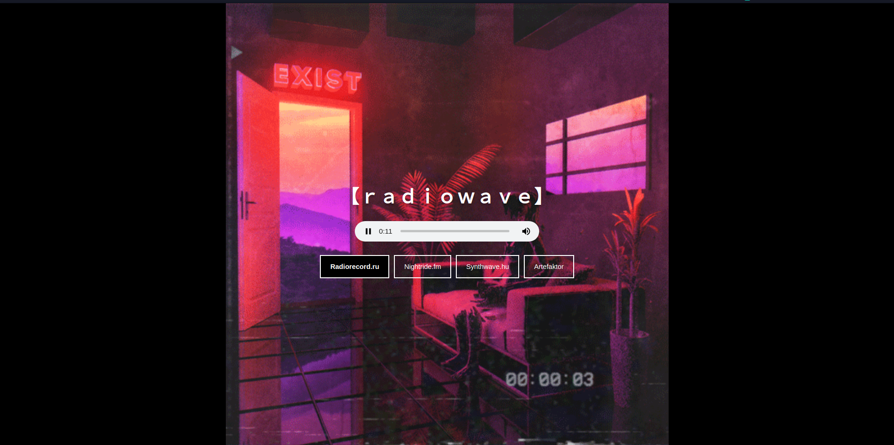
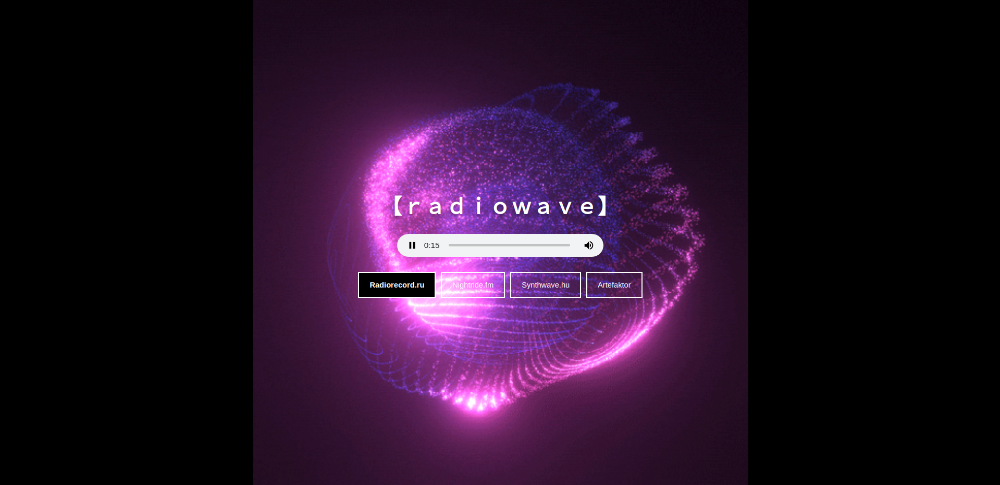

# RadioWave
A [WIP] minimal synthwave radio app with visuals from the Giphy API, made in ReactJs.

## Running the app
Add your GiphyAPI key in `App.js`
```
let response = await fetch(`https://api.giphy.com/v1/gifs/search?api_key=${config.API_KEY}&q=synthwave&limit=50&offset=0&rating=G&lang=en`)
```
Then do
```
yarn install
yarn start
```
## Screenshots




